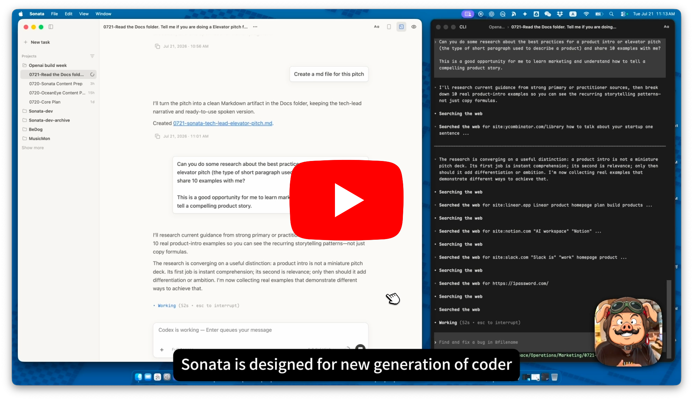

# Sonata

I'm a designer. I started agentic coding this February, and quickly
understood the benefits of the CLI. So I spent several weeks learning
it. Trust me, I really tried so hard to learn — I know how to use
Ctrl+U to clear a line, along with all the other tricks. But in the
end it still felt unintuitive for most people, and it was missing too
much of what I needed: a real reading experience, a modern way to
write prompts, pasting images, previews, session management. That was
the starting point for building Sonata.

> **The terminal is the best workspace for AI coding agents like
> Claude Code and Codex. Sonata is the workspace designed for humans.**

Sonata is for a new generation of coders, builders, and design
engineers — people whose workflow no longer centers on editing code,
but on working with AI: reading, giving direction, taste, and
judgment.

It's a free, open-source macOS app that runs your real Claude Code and
Codex CLIs — native behavior, native capabilities, your existing
subscription — and pairs them with a workspace built for the human
side of the work: reading what the agent did, directing what happens
next, organizing long-running work, and checking the results.

If you want all the benefits of the CLI with a modern experience, try
it — and leave your feedback.

[](https://youtu.be/Bvi27v0_OkI)

**[▶ Watch the 3-minute demo](https://youtu.be/Bvi27v0_OkI)**

## What Sonata does

**Read.** Agent sessions become something you can actually read. Sonata
normalizes Claude and Codex session data into clean turn cards —
markdown, folded tool calls, plan blocks, run attribution — with tuned
typography and light/dark reading themes. Live status (busy, idle,
waiting on you) comes from the CLI's own structured hooks, not from
scraping the screen.

**Write.** The composer is built for expressing intent: type naturally,
attach files and images, steer work that's already in flight. Slash
commands are semantic — skills become chips, stateful controls like
`/model` and `/permissions` open native popovers instead of text menus.

**Manage.** Sessions are working material, not history. Name them, tag
them, filter them, organize them by project. Open a dormant session and
read it instantly — it only resumes when you send something new. Each
task picks its provider (Claude or Codex) at creation.

**Preview.** Check outcomes without opening an editor. Markdown, HTML,
images, file trees, and changed files open in floating preview windows —
one click from the transcript to the thing the agent actually produced.

And when judgment is needed, you're in the loop at decision points, not
watching a command stream: approvals, questions, and permission changes
surface clearly in your workspace. The raw terminal stays one switch
away — same session, same process — and you can type into it anytime.

## What Sonata is not

- **Not a terminal skin.** The reading surface is built from structured
  session data, not from re-rendered terminal output.
- **Not an IDE.** There is deliberately no code editor inside.
- **Not a new agent runtime.** It runs your real `claude` and `codex`,
  unchanged.
- **Not another subscription.** Sonata is free and uses the Claude /
  Codex subscriptions you already have.
- **Not a cloud layer.** No account, no server, no telemetry. Sonata's
  own state lives on your machine.

## Design choices

- **Preserve the native agent.** Sonata runs the real CLIs and keeps
  their behavior, configuration, and update pace. It is an experience
  layer, not a fork.
- **No Sonata system prompt.** Sonata doesn't inject its own
  instructions into the agent. This is a product boundary, not a missing
  feature: you should get exactly the agent you'd get in the terminal.
- **Structured truth before screen scraping.** Signals come from hooks
  and session transcripts — data the CLIs deliberately expose. Reading
  the screen survives only as a narrow, labeled fallback.
- **No built-in editor; preview outcomes instead.** When you want to
  edit code or prose, your editor is better at it. What Sonata owns is
  the fast loop of *seeing what was produced*.
- **Separate windows by cognitive role.** The CLI and Preview live in
  their own windows rather than being squeezed into sidebars. Main
  window for direction and reading; CLI window for raw truth; Preview
  for results. On a large screen they sit side by side.
- **Local and inspectable.** Open source, no Sonata account, state on
  disk. Your prompts still go to Anthropic or OpenAI through the native
  CLIs — Sonata just refuses to add a new trust boundary in between.

## Caveats

Sonata is early, and shaped so far by one person's
daily use — mine. Real work runs through it every day, but the edges
show:

- Claude Code and Codex hooks / transcripts occasionally don't deliver a
  complete signal. That's why the CLI window is usually worth keeping
  open: it's the fallback and the diagnostic surface.
- Multiple windows across multiple macOS Spaces can get confusing. What
  works well: dedicate one Space to Sonata, main window and CLI window
  side by side.
- Claude and Codex are both supported, but feature parity between them
  is not promised.
- The upstream CLIs move fast. Specific gaps close, new ones open;
  expect occasional breakage right after a CLI update.
- macOS only.

If you hit one of these — or something new — please open an issue.
Knowing where it breaks for someone who isn't me is exactly what this
stage needs.

## Run it locally

You'll need:

- macOS
- Node.js 22.12 or newer
- Claude Code and/or Codex CLI installed and authenticated

```bash
git clone https://github.com/woody-design/sonata.git
cd sonata/app
npm install
npm run dev        # build + launch
```

To try it without touching your real data, run it sandboxed:

```bash
TMP="$(mktemp -d /tmp/sonata-XXXXXX)"
SONATA_DATA_DIR="$TMP" SONATA_WORKSPACES_DIR="$TMP/workspaces" npm run dev
```

To verify a change:

```bash
npm run build                      # typecheck + build all targets
npm run e2e:gui-walking-skeleton   # representative end-to-end gate
```

More smoke and e2e gates live in `app/package.json`.

## Q&A

**Why not just use the terminal?**
If the terminal works for you, keep it — Sonata even keeps it one
switch away. But the terminal is built around a command stream. Long
reading, natural input, session organization, and result browsing are
all things it does grudgingly. Sonata exists so that adapting to the
terminal isn't the price of using CLI agents.

**Why not the official Claude / Codex apps?**
The CLI is still the most native, most complete form of both agents —
closest to your local environment, first to get new capabilities, and
often more token-efficient: through precise, composable commands the
agent retrieves only the context the task needs. Sonata keeps that
runtime and builds the human experience around it instead of trading it
away.

**Why not Cursor or an IDE agent?**
IDE agents keep the code editor at the center, which assumes you still
work primarily *through code*. Sonata assumes you work primarily through
intent, reading, and judgment — and that you'd rather not adopt a second
agent runtime and subscription on top of the one you already pay for.

**Do I need another subscription?**
No. Sonata is free and runs on the Claude / Codex subscriptions you
already have.

**Does Sonata change what the agent does?**
No. No injected system prompt, no modified behavior. The agent you get
in Sonata is the agent you'd get in the terminal.

**Where does my data go?**
Same place it already goes: to Anthropic or OpenAI, through their own
CLIs. Sonata adds no account, no server, and no middle layer; its own
sessions and settings stay on your machine.

**Is Codex fully equal to Claude in Sonata?**
Both are supported; parity is not guaranteed. Some signals arrive
differently from each CLI, and features land where the upstream data
allows.

## License & trademark

Sonata's source code is licensed under the
[Apache License 2.0](LICENSE). "Sonata", the Sonata name, and the Sonata
logo are trademarks of Woody Li and are not licensed under Apache-2.0;
the license grants no permission to use them. Forks and redistributions
must use a different name and logo.
